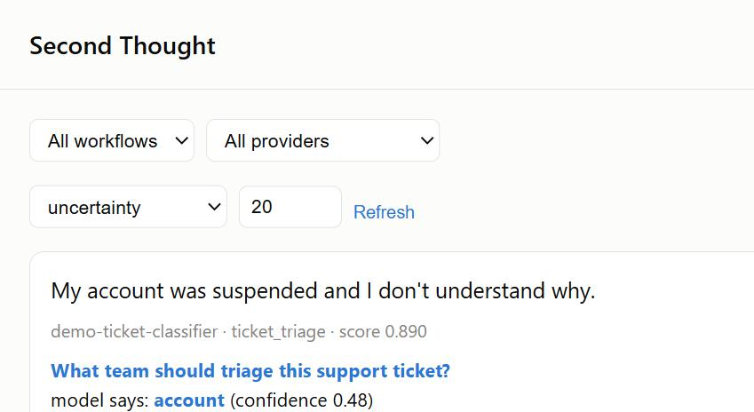

<div align="center">

# Second Thought

**Does your model's confidence number actually mean anything?**

[](https://github.com/KNambiarDJsc/second-thought/actions/workflows/ci.yml)
[](LICENSE)
[](pyproject.toml)
[](https://github.com/astral-sh/ruff)

[Quickstart](#quickstart) · [How it works](#how-it-works) · [Proof](#the-proof) · [Dashboard](#dashboard-and-drift-monitoring) · [Contributing](#contributing)

<br>



<sub>Real screenshot of <code>secondthought serve</code> — not a mockup.</sub>

</div>

<br>

> We ran this against a real model on a real GPU and it found a real problem: **87.5% accuracy,
> but an ECE of 0.62** — high accuracy, badly calibrated confidence. [See the receipts →](examples/laya_customer_service/results/report.md)

## The problem

A new class of model — TypeSafe's **Jev**, the open-weight **Laya**, and others — answers
questions with a probability instead of a paragraph: `choice`, `score`, or `noul` (yes/no), plus a
confidence number. The whole pitch of these models is "trust the number, act automatically above a
threshold, route to a human below it."

Nobody checks if that number is actually honest. And if you *do* have a human reviewing decisions,
nothing tells you which ones are worth their time.

## The fix

Second Thought captures every decision, measures whether its probabilities are really calibrated,
picks the ones most worth a human reviewing, and turns their corrections into a dataset you can
fine-tune on.

```
capture → store → select (most uncertain first) → review (CLI or web) → export → evaluate → watch for drift
```

Works with **any** model that returns a probability — Laya, a capture-only Jev adapter, or your
own classifier in one line (`FunctionProvider`). Laya and Jev just happen to be the two this
project has actually tested against.

## Quickstart

```bash
pip install -e ".[dev]"
```

```python
from second_thought import Store, capture, select, correct, export
from second_thought.adapters import FunctionProvider  # or LayaProvider, JevProvider, your own

provider = FunctionProvider("my-model", my_predict_fn)   # wraps any predict(state, questions) call
store = Store(".secondthought/store.db")

result = provider.predict(state, questions)
capture(store, result, provider=provider.name, state=state, questions=questions)

top = select(list(store.query()), budget=25)[0]           # the decision most worth reviewing
correct(store, top.event.id, top.question_id, value="refund")

export(list(store.query()), "dataset/")                    # fine-tune-ready, leak-free
```

Or skip Python entirely: `secondthought init | select | review | export | evaluate | serve`.

*(Not on PyPI yet — install from source. [Release process →](docs/releasing.md))*

## The proof

Every number here comes from a script in this repo. Run it yourself, don't take our word for it.

- **Real model, real GPU, real bug found.** Live Laya, 24 tickets: **87.5% accuracy**, **ECE
  0.62**. The uncertainty queue caught **3 of 3 real mistakes** while reviewing only a third of
  the tickets. [`examples/laya_customer_service/`](examples/laya_customer_service/)
- **Smart review beats random review, measured.** +0.106 accuracy gain from 75 corrections
  picked by uncertainty vs. +0.060 from 75 picked at random — **1.8×** more improvement per
  correction, consistent across 3 seeds. [`examples/toy_typed_decisions/`](examples/toy_typed_decisions/)
- **Not a Laya-only trick.** Same SDK, zero GPU, zero Laya, zero Jev — a plain scikit-learn
  text classifier. [`examples/generic_provider/`](examples/generic_provider/)
- **We show our failures too.** The active-learning strategy loses to random at large batch
  sizes — five real fix attempts tried, none worked, all written up instead of buried.
  [`docs/research/wedge-and-mvp-spec.md`](docs/research/wedge-and-mvp-spec.md)
- **72 tests, `mypy --strict`, `ruff` clean, CI green on Linux + Windows**, Python 3.11–3.13.
  [See for yourself](.github/workflows/ci.yml)

<details>
<summary><b>How does it compare to TensorZero, Evidently, Snorkel, etc.? (full 19-tool matrix)</b></summary>

| | Second Thought | LLM-ops<br>(TensorZero, Langfuse) | ML monitoring<br>(Evidently, WhyLabs) | Weak supervision<br>(Snorkel, Cleanlab) |
|---|:---:|:---:|:---:|:---:|
| Stores the full probability distribution | ✅ | ❌ | partial | ✅ |
| Calibration error (ECE) | ✅ | ❌ | ❌ | ❌ |
| ECE tracked over time, with drift alerts | ✅ | ❌ | ❌ | ❌ |
| Uncertainty-based review queue | ✅ | ❌ | ❌ | ✅ |
| Correction → fine-tune dataset export | ✅ | ✅ | ❌ | partial |
| Local web review UI, no terminal | ✅ | varies | varies | varies |
| Typed-decision native (not LLM-text) | ✅ | ❌ | ✅ | ✅ |

No single tool surveyed does the whole row. Full 19-tool breakdown, sourced from each tool's own
docs: [`docs/research/competitive-matrix.md`](docs/research/competitive-matrix.md).
</details>

## How it works

`SystemOneProvider` is a two-method interface (`predict()`, `model_info()`). `FunctionProvider`
wraps any plain function that returns `{"model", "answers"}` — no subclassing needed. Everything
downstream (storage, selection, correction, export, evaluation) is model-agnostic; it only ever
touches that one shape.

## Dashboard and drift monitoring

- **`secondthought serve`** — the local web UI in the screenshot above. A review queue that
  doesn't need a terminal, plus a calibration chart per workflow.
- **`second_thought.drift`** — the same calibration check, bucketed over time and flagged with a
  standard control chart when it degrades. Most tools check calibration once; this watches it.
- **`second_thought.protocol`** — the request/response shape, published as JSON Schema plus a
  conformance checker, so anyone building a System One model can check their API against it.

All three are thin layers over the same `Store`/`select`/`correct`/`evaluate` functions above — no
parallel implementation. Background and the ecosystem research behind this:
[`docs/research/decision-control-plane.md`](docs/research/decision-control-plane.md).

## Laya vs. Jev

Laya (Apache-2.0, open-weight) is the one model this project fine-tunes end-to-end. Jev decisions
can be captured for your own observability, but TypeSafe's license forbids training on Jev's
output — so `export()` **hard-blocks Jev in code**, not just in a docs warning. Bring your own
model via `FunctionProvider` and it's just as fine-tunable as Laya. [Details →](docs/research/laya-architecture.md)

<details>
<summary><b>What this deliberately does not build</b></summary>

Not a prompt manager, not a generic LLM observability platform, not a generic annotation tool, not
a model registry, not distributed infrastructure. The dashboard is scoped to this SDK's own loop —
not general tracing or prompt playgrounds. Full reasoning for each cut:
[`docs/research/wedge-and-mvp-spec.md`](docs/research/wedge-and-mvp-spec.md).
</details>

## Status

**v0.1.0, alpha.** Real, tested, run against a real model — see [The proof](#the-proof). Not on
PyPI yet. API may still move before v1.

## Contributing

Young project, young category — there's real ground still uncovered. Start with
[`CONTRIBUTING.md`](CONTRIBUTING.md). Bringing your own System One model is one of the
highest-leverage contributions there is.

[Discussions](https://github.com/KNambiarDJsc/second-thought/discussions) for questions ·
[Issues](https://github.com/KNambiarDJsc/second-thought/issues) for bugs and feature requests.

## License

[Apache License 2.0](LICENSE).
